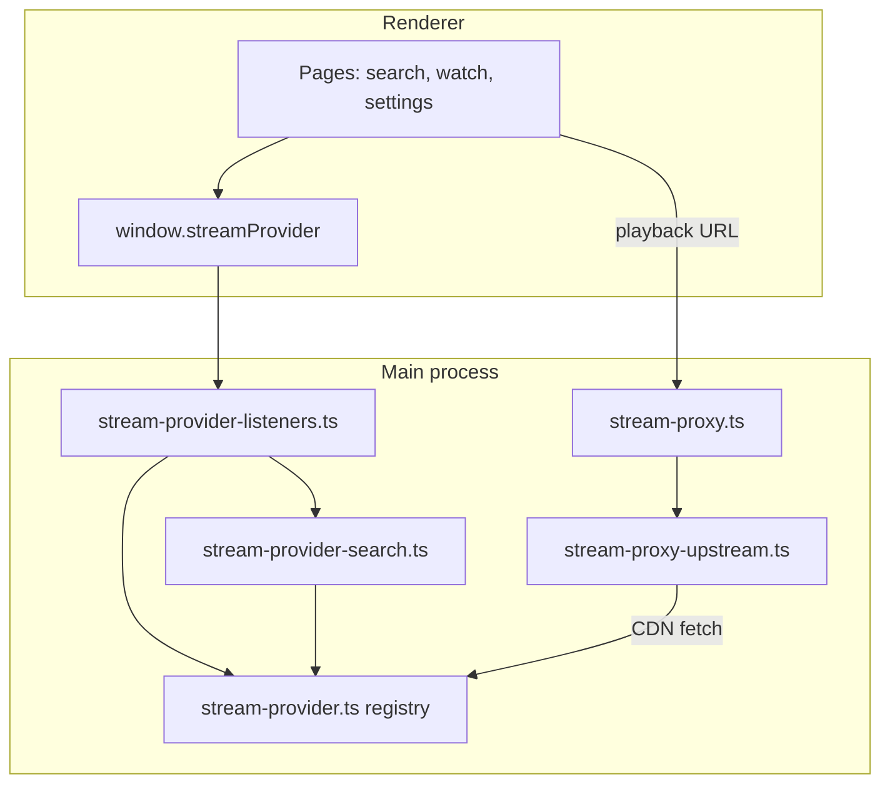

# Contributing — Stream providers

This guide explains how to add or maintain a **stream provider** in the Openanime desktop app. Stream providers are the plugins that search catalogs, list episodes, and resolve playable URLs.

The app is Electron-based: provider logic runs in the **main process**; the renderer talks to providers only through `window.streamProvider` (preload IPC bridge).

## Architecture



**Typical playback path**

1. Renderer calls `getStreamUrl(id, providerId, episode, mode)`.
2. Provider returns `{ url, referer }` (direct CDN or HLS URL).
3. Renderer builds a local proxy URL:  
   `http://127.0.0.1:{port}/stream?url=...&referer=...`  
   (optional `&transcode=1` for HLS — see [Stream proxy](#stream-proxy)).
4. `<video>` plays the proxied URL so Range requests and referer headers work consistently.

---

## Provider contract

The minimal interface lives in `src/main/ipc/stream-provider/stream-providers/stream-provider.ts`:

```typescript
export interface StreamProvider {
  getStreamUrl(
    id: string | null,
    providerId: string | null,
    episode: string,
    mode: StreamMode // "sub" | "dub"
  ): Promise<StreamUrlResult>;

  getRecentUploads(page: number, limit?: number, mode?: StreamMode): Promise<Episode[]>;
  search(query: string): Promise<ShowSearchResult[]>;
}

export interface StreamUrlResult {
  url: string;
  referer: string;
}
```

### ID fields

| Parameter    | Meaning                                                                   |
| ------------ | ------------------------------------------------------------------------- |
| `id`         | Often an **AniList** media id when known; may be `null`.                  |
| `providerId` | Your provider’s native show id (required for playback on most providers). |
| `episode`    | Episode number or label as a string (e.g. `"12"`).                        |

Search results and episodes should populate both `id` and `providerId` on `ShowSearchResult` / `Episode` (see `src/shared/types.d.ts`).

## Enabling and disabling providers

Ship-time toggles live in `src/shared/stream-providers.config.ts`. Set a provider to `false` to hide it from Settings and route all IPC calls (including watch-history overrides) to the first enabled provider instead.

At least one provider must stay enabled or startup will throw. Labels and helper functions live in `src/shared/stream-providers.ts`.

---

## Registering a new provider

`StreamProviderName` is derived from `stream-providers.config.ts`. When adding a provider (e.g. `myprovider`), update **all** of:

| File                                    | Change                                        |
| --------------------------------------- | --------------------------------------------- |
| `src/shared/stream-providers.config.ts` | Add provider id set to `true`                 |
| `src/shared/stream-providers.ts`        | Add display label in `STREAM_PROVIDER_LABELS` |
| `stream-providers/stream-provider.ts`   | Import class, add registry entry              |
| `src/shared/types.d.ts`                 | Extend `StreamProvider` union                 |
| `src/main/store.ts`                     | Extend `"stream.provider"` schema             |

Optional, depending on your integration:

| File                           | When                                                          |
| ------------------------------ | ------------------------------------------------------------- |
| `stream-provider-search.ts`    | Native `getEpisodesList` / `getShowDetails`, or new GQL paths |
| `stream-provider-listeners.ts` | `registerStreamUpstreamHandler()` for CDN-specific fetch      |
| `stream-provider-channels.ts`  | Only if you need new IPC channels (rare)                      |

Invalid or disabled stored values fall back to the first enabled provider (`resolveEnabledStreamProvider` in `stream-providers.ts`).

---

## Renderer API (do not bypass)

Providers are **not** callable from the renderer directly. Use the preload bridge:

- Context: `src/main/ipc/stream-provider/stream-provider-context.ts`
- Channels: `src/main/ipc/stream-provider/stream-provider-channels.ts`
- Types: `window.streamProvider` in `src/shared/types.d.ts`

`providerName` / `providerOverride` on `getEpisodes` and `getStreamUrl` lets the watch page use a show’s original provider without changing the global setting.

---

## Integration patterns

Three reference implementations cover most approaches:

| Provider      | Style                                           | Main files                                                         |
| ------------- | ----------------------------------------------- | ------------------------------------------------------------------ |
| **AllAnime**  | GraphQL + embed resolution                      | `allanime/allanime-stream-provider.ts`, `allanime/allanime-gql.ts` |
| **AnimePahe** | HTML/API scrape + hidden browser for challenges | `animepahe-stream-provider.ts`                                     |
| **Reanime**   | REST API + Flixcloud decrypt + proxy upstream   | `reanime/reanime-stream-provider.ts`, `reanime/flixcloud-*.ts`     |
| **Senshi**    | REST API → HLS (MAL-keyed)                      | `senshi/senshi-stream-provider.ts`, `anilist/anilist-mal.ts`       |

### REST / JSON API

- Use `getElectronUserAgent()` on every outbound request.
- Map responses to `ShowSearchResult` and `Episode` shapes.
- Empty search often doubles as “recent uploads” (see AnimePahe / Reanime).

### Scraping + anti-bot

Node `fetch` is often blocked (Cloudflare, DDoS-Guard, TLS fingerprinting). Patterns in the codebase:

1. **Ephemeral hidden `BrowserWindow`** (AnimePahe) — `show: false`, dedicated `persist:` partition, destroy after use.
2. **Warmed persistent browser** (Flixcloud) — reuse session cookies, serialize requests, gate token APIs via `webRequest`.
3. **`electron.net.fetch` or `session.fetch`** with a partition.
4. **`curl` subprocess** as last resort (`flixcloud-curl-fetch.ts`).

**Challenge polling** — wait until the page is past interstitials (title/body heuristics: “just a moment”, “checking your browser”, “ddos-guard”, “captcha”). Timeouts are long (45–70s). See `waitChallenge` in AnimePahe / Flixcloud modules.

### Referer matters

`getStreamUrl` must return the referer the CDN expects. Wrong referer → 403 on segments.

Example (Reanime / Flixcloud): playback uses `https://flixcloud.cc/` as referer, not the embed URL, because some CDN hosts reject cross-subdomain embed referers.

---

## User-Agent

Electron’s default UA includes `Openanime/…` and `Electron/…`. At startup, `initElectronUserAgent()` in `main.ts` normalizes the **default session** UA.

For main-process fetches, always use:

```typescript
import { getElectronUserAgent } from "@/main/electron-user-agent";

headers: { "User-Agent": getElectronUserAgent() }
```

See `src/main/electron-user-agent.ts`.

---

## Stream proxy

`src/main/stream-proxy.ts` runs a local HTTP server (`127.0.0.1`, random port) that:

- Forwards **Range** requests to the real CDN URL.
- Rewrites **HLS** manifests so segment URLs also go through the proxy.
- Optionally **transcodes** HLS to progressive MP4 (`transcode=1`; requires bundled ffmpeg).

The renderer builds proxy URLs in `src/renderer/pages/watch-page.tsx`:

```typescript
const { url, referer } = await window.streamProvider.getStreamUrl(...);
const base = await window.streamProvider.getStreamProxyBaseUrl();
const proxied = `${base}/stream?url=${encodeURIComponent(url)}&referer=${encodeURIComponent(referer)}`;
```

**You usually do not implement proxy logic in the provider** — only return a correct `url` + `referer`.

### Upstream handlers

When CDN fetches need a browser session (cookies, TLS, bot bypass), register a `StreamUpstreamHandler` in `src/main/stream-proxy-upstream.ts`:

```typescript
export interface StreamUpstreamHandler {
  matches(ctx: { targetUrl: string; referer: string | null }): boolean;
  normalizeReferer?(targetUrl: string, referer: string | null): string | null;
  fetch(ctx: StreamUpstreamFetchContext): Promise<Response>;
}
```

Register at module load in `stream-provider-listeners.ts` (Reanime example: `reanime/reanime-stream-upstream.ts`).

- **`matches`** — keep narrow; first matching handler wins.
- **`normalizeReferer`** — fix referer before proxy forwards (Flixcloud embed → site root).
- **`fetch`** — often `session.fromPartition(...).fetch`, then hidden-browser fallback.

---

## Development workflow

```bash
cd desktop
npm i
npm run start
```

Provider code runs in the main process; restart the app after main-process changes.

### Logging

The app uses [`electron-log`](https://www.npmjs.com/package/electron-log) (`src/main/logger.ts`). Each launch writes a new session file (e.g. `main-2026-07-12T17-36-05-123Z.log`) in the OS log directory (macOS: `~/Library/Logs/Openanime/`, Linux/Windows: under the app userData `logs/` folder). Users can open that folder from **Settings → Logs**. Files older than 30 days are deleted on startup and daily while the app runs.

In development, providers still log with tagged prefixes, e.g.:

- `[allanime-stream]`
- `[animepahe-provider]`
- `[reanime-provider]`
- `[stream-proxy]`, `[reanime-upstream]`

Follow the same pattern for new providers. Prefer `console.*` / `log.*` with those tags so messages land in both the console and the log file.

### Manual test checklist

There are no automated stream-provider tests yet. Before opening a PR, verify:

- [ ] Search returns sensible `ShowSearchResult` rows (`id`, `providerId`, titles, thumbnails).
- [ ] Empty search / home “recent uploads” works if applicable.
- [ ] Episode list loads for **sub** and **dub** (or documented limitation).
- [ ] Show details page loads (title, thumbnail, description).
- [ ] Playback starts and **seeking** works (Range via proxy).
- [ ] HLS streams play (with transcode path if `.m3u8`).
- [ ] Switching global provider in Settings uses your implementation.
- [ ] Watch page with `providerOverride` still resolves URLs correctly.

---

## Common pitfalls

| Pitfall                                | Guidance                                                                       |
| -------------------------------------- | ------------------------------------------------------------------------------ |
| Forgetting a `StreamProviderName` site | Build may pass but UI falls back to AllAnime or fails validation.              |
| Missing or wrong **referer**           | Test actual playback through the proxy, not only `getStreamUrl` in isolation.  |
| Raw Electron User-Agent                | Use `getElectronUserAgent()` after `initElectronUserAgent()`.                  |
| Assuming Node `fetch` is enough        | Plan a browser or session fallback early if the site uses bot protection.      |
| Broad upstream `matches()`             | Can break unrelated CDN URLs; scope to your host/path patterns.                |
| Blocking the main process              | Long challenge waits should use timeouts; consider serializing browser access. |
| AniList vs stream provider             | `window.anilist` is metadata/OAuth only — not part of stream resolution.       |

---

## File map (quick reference)

```
src/main/
  electron-user-agent.ts          # UA normalization
  stream-proxy.ts                 # Local playback proxy
  stream-proxy-upstream.ts        # Pluggable CDN fetch handlers
  main.ts                         # initElectronUserAgent, startStreamProxy
  ipc/stream-provider/
    stream-provider-channels.ts
    stream-provider-context.ts    # preload → window.streamProvider
    stream-provider-listeners.ts  # ipcMain handlers
    stream-provider-search.ts     # episodes + show details routing
    stream-providers/
      stream-provider.ts          # interface + registry
      allanime/
      animepahe-stream-provider.ts
      reanime/
src/renderer/pages/
  watch-page.tsx                  # proxy URL + transcode
  settings-page.tsx               # provider picker
src/shared/types.d.ts             # Episode, ShowSearchResult, Window types
```

---

## Questions and PRs

- Open a [GitHub issue](https://github.com/wuon/openanime/issues) to discuss a new provider before a large PR.
- Keep provider-specific code under `stream-providers/<name>/`.
- Prefer matching existing naming, logging, and error-handling style over new abstractions.
